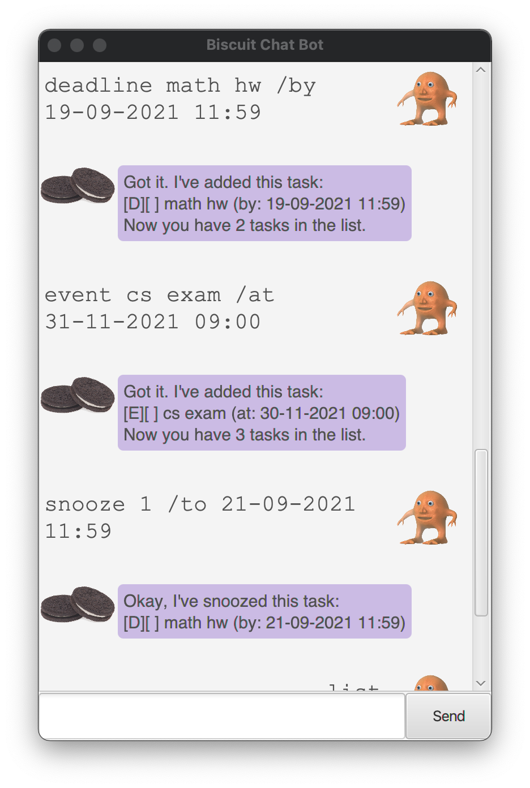

# User Guide

Biscuit is a **desktop app for managing task, optimized for use via a Command Line Interface** (CLI)
while still having the benefits of a Graphical User Interface (GUI). If you can type fast, Biscuit can get your task
management done faster than traditional GUI apps.

## Quick Start

1. Ensure you have Java 11 or above installed in your Computer.
2. Download the latest biscuit.jar from [here](https://github.com/luffingluffy/ip/releases/tag/A-Release).
3. Copy the file to the folder you want to use as the home folder for your Biscuit.
4. Double-click the file to start the app. The GUI similar to the below should appear in a few seconds. 
6. Type your commands in the chat box e.g. `list`
7. Refer to the **Features** below for details of each command.

## Features

### Add a Todo task: `todo`

Adds a todo task with the given description.

Format: `todo DESCRIPTION`

Example of usage: `todo CS Homework`

Expected outcome:

Biscuit prints the following confirmatory message.

```
Got it. I've added this task:
[T][ ] CS Homework
Now you have 1 task in the list.
```

### Add a Deadline task: `deadline`

Adds a Deadline task with the given description and deadline in *DD-MM-YYYY HH:mm* format.

Format: `deadline DESCRIPTION /by DATE`

Example of usage: `deadline Math Homework /by 01-01-2020 11:30`

Expected outcome:

Biscuit prints the following confirmatory message.

```
Got it. I've added this task:
[D][ ] Math Homework (by: 01-01-2020 11:30)
Now you have 2 tasks in the list.
```

### Add an Event task: `event`

Adds a Deadline task with the given description and date in *DD-MM-YYYY HH:mm* format.

Format: `event DESCRIPTION /at DATE`

Example of usage: `event Exam /at 15-06-2021 09:00`

Expected outcome:

Biscuit prints the following confirmatory message.

```
Got it. I've added this task:
[E][ ] Exam (at: 15-06-2021 09:00)
Now you have 3 tasks in the list.
```

### Find tasks based on keywords: `find`

Find tasks with the given keyword(s).

Format: `find KEYWORD`

Example of usage: `find Homework`

Expected outcome:

Biscuit prints a list of tasks containing the given keyword.

```
Here are the matching tasks in your list:
1. [T][ ] CS Homework
2. [D][ ] Math Homework (by: 01-01-2020 11:30)
```

### Mark a task as complete: `done`

Marks the task at the given index as done.

Format: `done INDEX`

Example of usage: `done 3`

Expected outcome:

Biscuit prints the following confirmatory message.

```
Nice! I've marked this task as done:
[E][X] Exam (at: 15-06-2021 09:00)
```

### Delete a task: `delete`

Deletes the task at the given index.

Format: `delete INDEX`

Example of usage: `delete 2`

Expected outcome:

Biscuit prints the following confirmatory message.

```
Noted. I've removed this task:
[D][ ] Math Homework (by: 01-01-2020 11:30)
Now you have 2 tasks in the list.
```

### Retrieve list of all tasks: `list`

Prints a list containing all the tasks.

Example of usage: `list`

Expected outcome:

Biscuit prints the list of all your tasks.

```
Here are the tasks in your list:
1. [T][ ] CS Homework
2. [E][X] Exam (at: 15-06-2021 09:00)
```

### Exit the app: `bye`

Closes the Biscuit Chat Bot window.

Example of usage: `bye`

Expected outcome:

Biscuit replies with a farewell message.

```
Bye. Hope to see you again soon!
```
